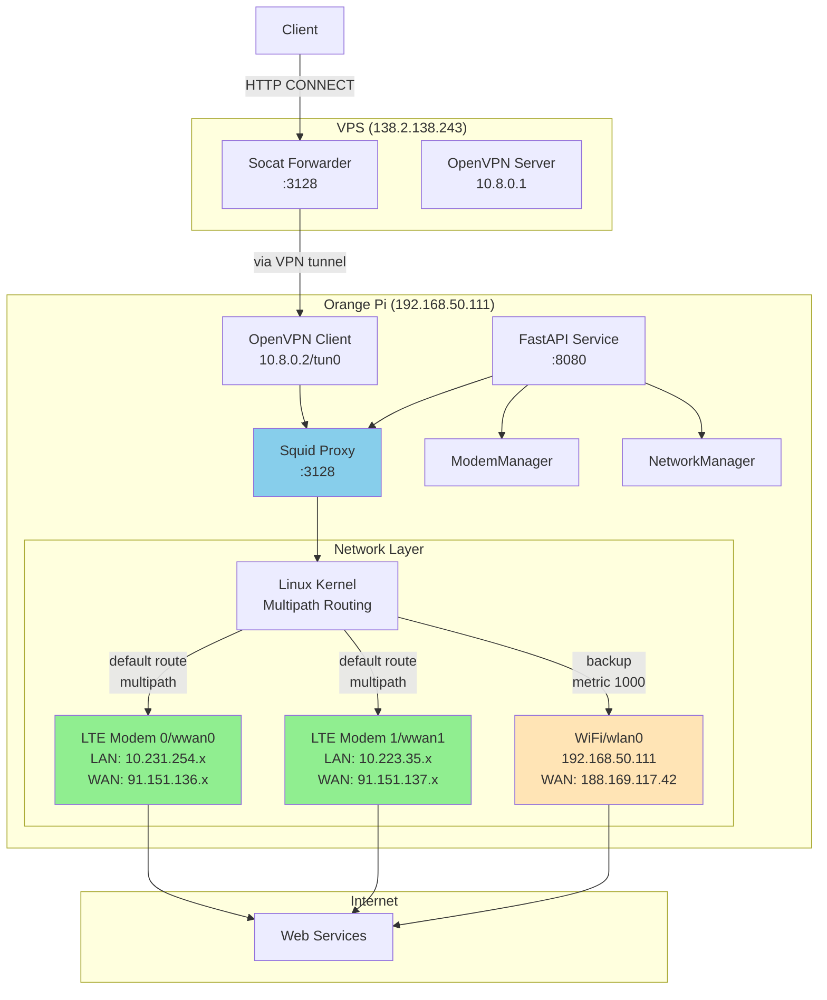
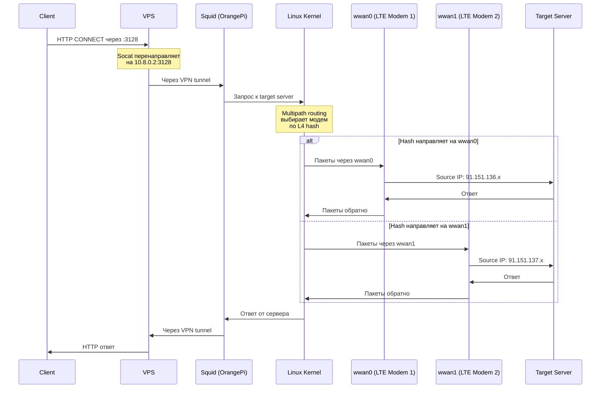
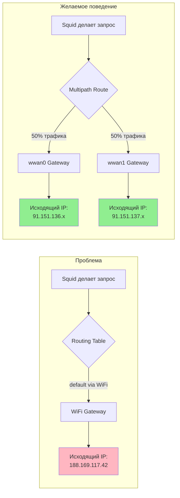
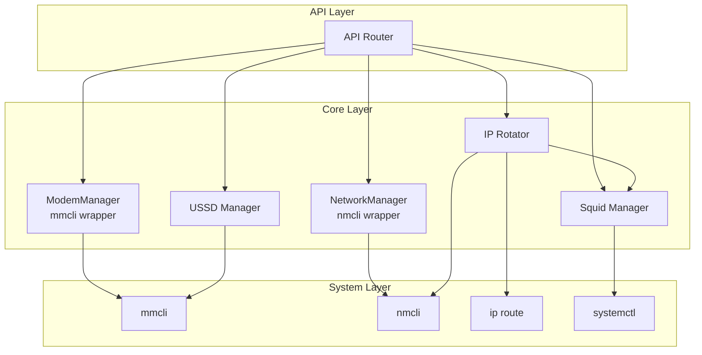
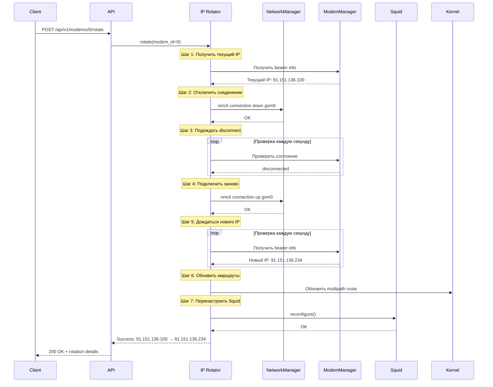
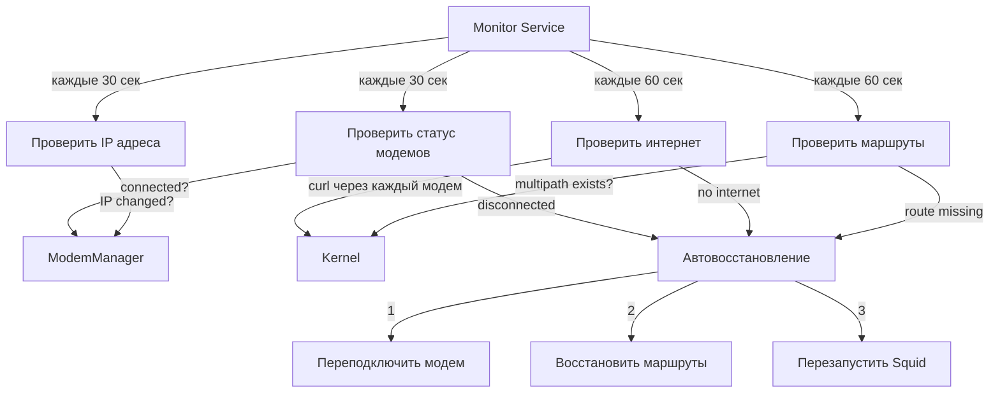

# Архитектура ProxyFarm

## Обзор системы

ProxyFarm — это система управления LTE модемами с HTTP API для ротации IP-адресов и проксирования трафика через мобильные сети. Система работает на Orange Pi Zero 3 под управлением Armbian (Ubuntu).

## Компоненты системы

### 1. Аппаратный уровень
- **Orange Pi Zero 3** - основной контроллер
- **2x LTE модемы** (wwan0, wwan1) - выход в интернет через мобильные сети
- **WiFi (wlan0)** - управление и резервный канал
- **VPS** - публичный прокси-сервер для доступа к системе

### 2. Программный стек

#### Системные компоненты
- **ModemManager** - управление LTE модемами
- **NetworkManager** - управление сетевыми подключениями
- **Linux Kernel Routing** - multipath маршрутизация
- **Squid 6.13** - HTTP/HTTPS прокси-сервер
- **OpenVPN** - защищенное соединение между VPS и Orange Pi

#### Приложение ProxyFarm
- **FastAPI** - HTTP API сервер
- **Python 3.11+** - основной язык
- **asyncio** - асинхронные операции
- **systemd** - управление сервисами

## Архитектура сети



## Поток данных

### Запрос через прокси



## Логика маршрутизации

### Текущая проблема



### Решение: Multipath Routing

Таблица маршрутизации должна выглядеть так:

```bash
# Приоритетный маршрут - multipath через оба модема
default
    nexthop via 10.231.254.1 dev wwan0 weight 1
    nexthop via 10.223.35.1 dev wwan1 weight 1

# Резервный маршрут через WiFi
default via 192.168.50.1 dev wlan0 metric 1000
```

Kernel использует L4 hash (source IP, dest IP, source port, dest port) для выбора nexthop, что обеспечивает:
- Одно TCP соединение всегда идет через один модем
- Разные соединения распределяются между модемами
- Балансировка нагрузки

## Структура API

```mermaid
graph TD
    API[FastAPI Application :8080]

    API --> MODEMS[/api/v1/modems]
    API --> USSD[/api/v1/ussd]
    API --> PROXY[/api/v1/proxy]
    API --> SYSTEM[/api/v1/system]

    MODEMS --> LIST[GET / - Список модемов]
    MODEMS --> GET[GET /{id} - Инфо о модеме]
    MODEMS --> ROTATE[POST /{id}/rotate - Ротация IP]
    MODEMS --> ENABLE[POST /{id}/enable - Включить]
    MODEMS --> DISABLE[POST /{id}/disable - Выключить]

    USSD --> SEND[POST /{id}/ussd - USSD команда]

    PROXY --> STATUS[GET /status - Статус Squid]
    PROXY --> RECONFIG[POST /reconfigure - Перенастроить]

    SYSTEM --> SYSSTATUS[GET /status - Статус системы]
    SYSTEM --> HEALTH[GET /health - Health check]

    style API fill:#87CEEB
    style MODEMS fill:#FFE4B5
    style USSD fill:#FFE4B5
    style PROXY fill:#FFE4B5
    style SYSTEM fill:#FFE4B5
```

## Core модули



## Процесс ротации IP



## Мониторинг (будущая функциональность)



## Скрипты и автоматизация

```mermaid
graph TB
    subgraph Setup Scripts
        SETUP_MODEMS[setup_modem_routing.sh]
        SETUP_SQUID[setup_squid.sh]
        SETUP_VPS[setup_vps_proxy_forward.sh]
    end

    subgraph Installation Scripts
        INSTALL_NM[install_nm_dispatcher.sh]
        INSTALL_SERVICE[install_routing_service.sh]
    end

    subgraph Systemd Units
        PROXYFARM_SERVICE[proxyfarm.service<br/>FastAPI app]
        ROUTING_SERVICE[modem-routing.service<br/>Routing setup]
        ROUTING_TIMER[modem-routing.timer<br/>Periodic check]
        SQUID_SERVICE[squid.service<br/>Proxy server]
    end

    subgraph NetworkManager
        NM_DISPATCHER[/etc/NetworkManager/dispatcher.d/<br/>99-modem-routing]
    end

    INSTALL_NM -->|creates| NM_DISPATCHER
    INSTALL_SERVICE -->|creates| ROUTING_SERVICE
    INSTALL_SERVICE -->|creates| ROUTING_TIMER

    NM_DISPATCHER -->|runs on connection change| SETUP_MODEMS
    ROUTING_TIMER -->|runs every 5 min| ROUTING_SERVICE
    ROUTING_SERVICE -->|executes| SETUP_MODEMS

    SETUP_MODEMS -->|calculates gateways| IPROUTE[ip route commands]
    SETUP_SQUID -->|generates config| SQUID_CONF[/etc/squid/squid.conf]

    PROXYFARM_SERVICE -->|manages| API[FastAPI :8080]
    SQUID_SERVICE -->|runs| SQUID[Squid :3128]

    style NM_DISPATCHER fill:#90EE90
    style ROUTING_SERVICE fill:#87CEEB
    style ROUTING_TIMER fill:#87CEEB
```

## Конфигурация

### config.yaml структура

```yaml
api:
  host: "0.0.0.0"
  port: 8080
  api_key: "secret-key-here"

modems:
  apn: "internet"
  expected_count: 2

proxy:
  port: 3128
  allowed_networks:
    - "10.8.0.0/24"  # VPN network
    - "192.168.50.0/24"  # Local network

routing:
  l4_hash_enabled: true  # Use L4 hash for multipath
  wifi_backup_metric: 1000

monitor:
  enabled: true
  interval: 30
  auto_reconnect: true
  health_check_urls:
    - "http://ifconfig.me"
    - "http://api.ipify.org"
```

## Ключевые технические детали

### 1. Multipath Routing

**Алгоритм балансировки:**
- Kernel использует `fib_multipath_hash_policy = 1` (L4 hash)
- Хеш вычисляется по: source IP, dest IP, source port, dest port
- Одно TCP соединение всегда идет через один nexthop
- Разные соединения распределяются между nexthop'ами

**Преимущества:**
- Нет разрыва TCP соединений
- Эффективная балансировка на уровне соединений
- Работает прозрачно для приложений

### 2. Squid конфигурация

**Ключевые директивы:**
```squid
# ACL для доступа только с VPN
acl vpn_network src 10.8.0.0/24
http_access allow vpn_network

# НЕ используем tcp_outgoing_address
# Squid использует kernel routing для выбора интерфейса

# DNS кеширование
dns_nameservers 8.8.8.8 8.8.4.4

# Connection pooling
client_persistent_connections on
server_persistent_connections on
pconn_timeout 1 minute
```

**Почему не используем tcp_outgoing_address:**
- Squid не может балансировать между несколькими IP
- Kernel routing с multipath делает это лучше
- Прозрачность для приложения

### 3. Вычисление Gateway

```bash
# Получаем IP интерфейса
IP0=$(ip -4 addr show wwan0 | grep -oP 'inet \K[\d.]+')
# Пример: 10.231.254.77

# Вычисляем gateway (.1 в той же подсети)
GW0=$(echo $IP0 | sed 's/\.[0-9]*$/\.1/')
# Результат: 10.231.254.1
```

**Почему так работает:**
- Мобильные операторы используют /24 или /30 подсети
- Gateway всегда .1 в подсети
- ModemManager bearer иногда не возвращает gateway

## Проблемы и решения

### Проблема 1: NetworkManager восстанавливает WiFi маршрут

**Причина:** NetworkManager автоматически управляет маршрутами для всех подключений

**Решение 1 (Рекомендуется):** NetworkManager Dispatcher
- Скрипт запускается при любом изменении подключений
- Автоматически восстанавливает multipath routing
- Стандартный механизм Linux

**Решение 2:** Systemd Timer
- Периодически проверяет и восстанавливает маршруты
- Проще для отладки
- Небольшая задержка между нарушением и восстановлением

### Проблема 2: Squid отдает WiFi IP вместо модемного

**Причина:** Default route идет через WiFi, а не через модемы

**Решение:** Multipath route с приоритетом выше, чем WiFi
```bash
# Multipath через модемы (без metric = metric 0 = наивысший приоритет)
default nexthop via 10.231.254.1 dev wwan0 weight 1 \
        nexthop via 10.223.35.1 dev wwan1 weight 1

# WiFi как backup с низким приоритетом
default via 192.168.50.1 dev wlan0 metric 1000
```

### Проблема 3: Медленные запросы через прокси

**Причины:**
- Устаревшие директивы Squid
- Отсутствие DNS кеширования
- Нет connection pooling

**Решение:**
- Удалены obsolete директивы
- Добавлен DNS кеширование (8.8.8.8)
- Включен connection pooling
- Результат: с 29 сек → 1.4-3 сек

## Метрики и мониторинг

### Что отслеживать

1. **Состояние модемов**
   - Статус подключения (connected/disconnected)
   - Сила сигнала
   - Текущий IP адрес

2. **Сеть**
   - Наличие multipath route
   - Metric маршрутов
   - Доступность интернета через каждый модем

3. **Прокси**
   - Squid running/stopped
   - Количество активных соединений
   - Исходящие IP адреса

4. **Производительность**
   - Время ответа прокси
   - Балансировка трафика между модемами
   - Количество ротаций IP

### Логи

```bash
# FastAPI logs
journalctl -u proxyfarm.service -f

# Squid logs
tail -f /var/log/squid/access.log

# Routing logs (если используется timer)
journalctl -u modem-routing.service -f

# NetworkManager dispatcher logs
journalctl -f | grep NM-Dispatcher

# Системные сетевые события
journalctl -f | grep -E "wwan|NetworkManager"
```

## Следующие шаги

1. ✅ Создать FastAPI приложение с базовыми endpoints
2. ✅ Реализовать ротацию IP
3. ✅ Настроить Squid proxy
4. ✅ Настроить VPS forwarding
5. ✅ Оптимизировать производительность прокси
6. ✅ Создать скрипт multipath routing
7. 🔄 **[ТЕКУЩАЯ ЗАДАЧА]** Сделать multipath routing persistent
8. ⏳ Протестировать балансировку нагрузки
9. ⏳ Реализовать фоновый мониторинг
10. ⏳ Добавить автовосстановление при сбоях
11. ⏳ Создать systemd service для FastAPI
12. ⏳ Написать документацию API
