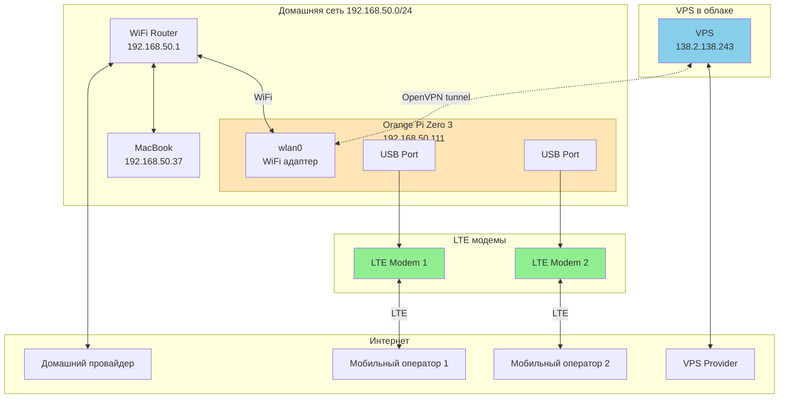
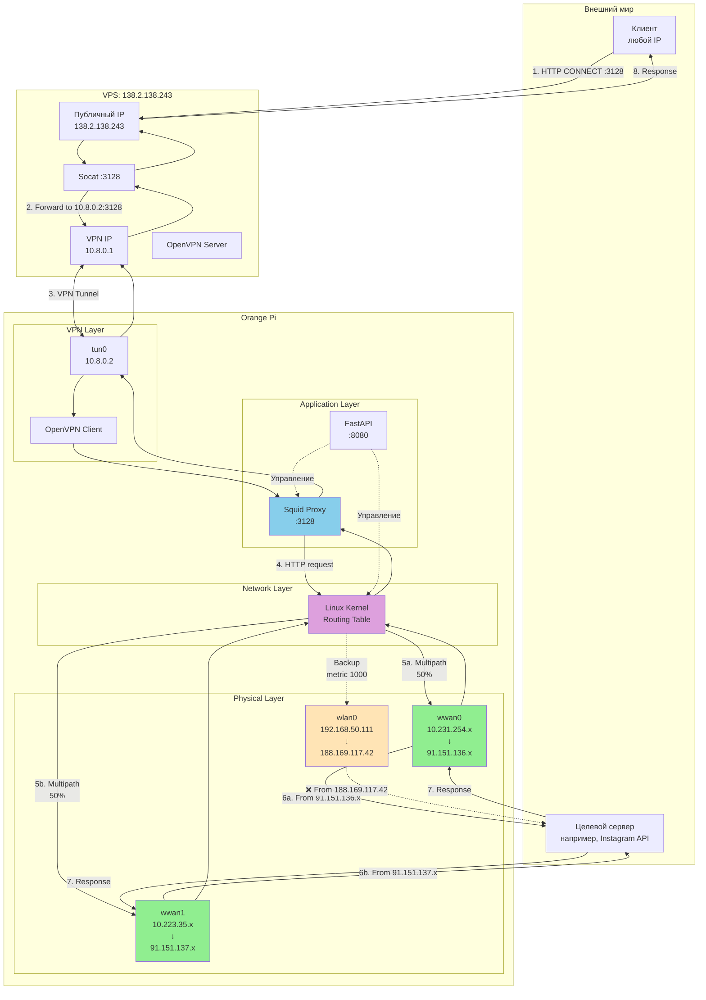
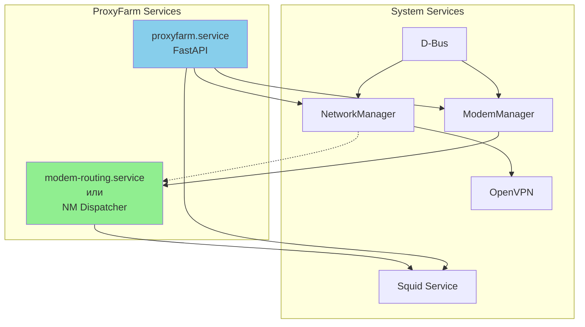
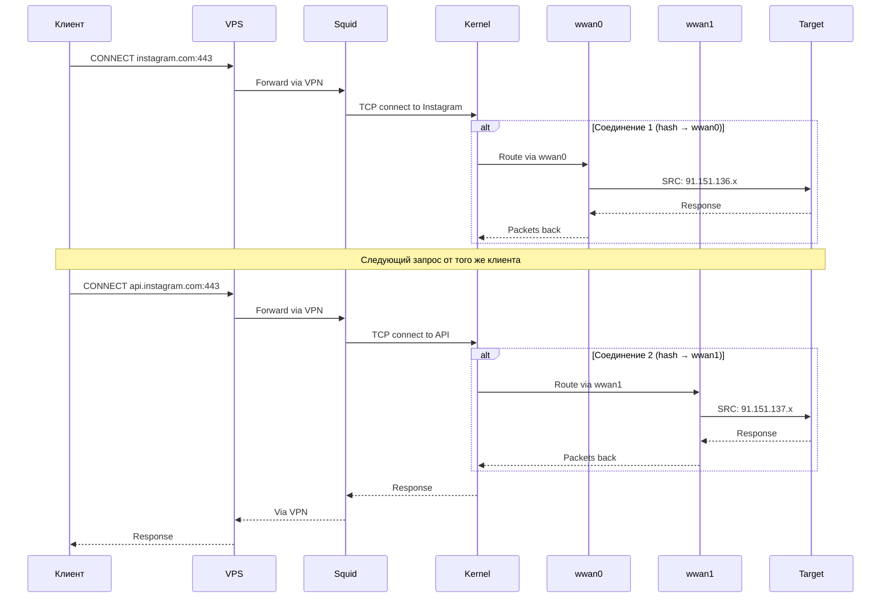
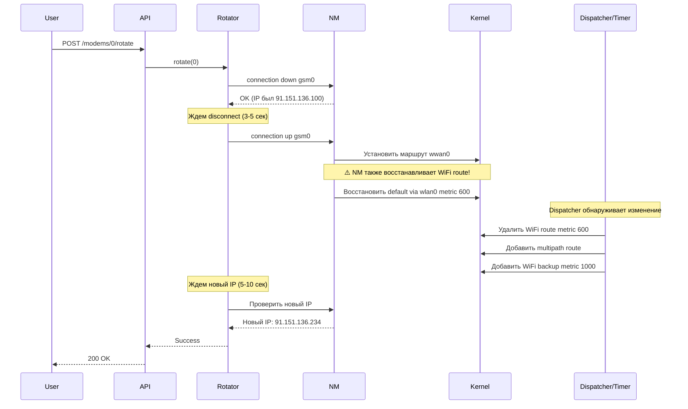
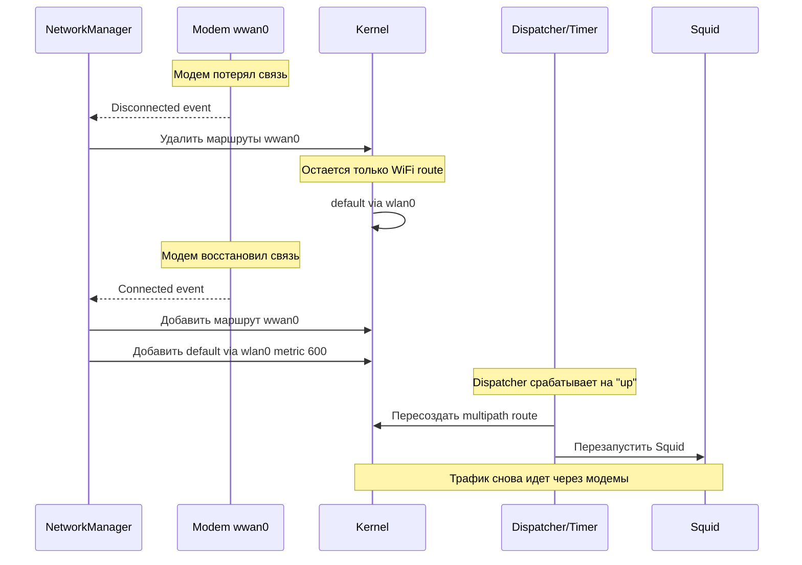

# Топология сети ProxyFarm

## Физическая топология



## Логическая топология



## IP адреса и интерфейсы

| Интерфейс | LAN IP | WAN IP | Gateway | Metric | Назначение |
|-----------|---------|---------|---------|---------|------------|
| **wwan0** | 10.231.254.x | 91.151.136.x | 10.231.254.1 | 0 (multipath) | LTE модем 1 |
| **wwan1** | 10.223.35.x | 91.151.137.x | 10.223.35.1 | 0 (multipath) | LTE модем 2 |
| **wlan0** | 192.168.50.111 | 188.169.117.42 | 192.168.50.1 | 1000 | WiFi (backup) |
| **tun0** | 10.8.0.2 | - | 10.8.0.1 | - | VPN tunnel |

## Таблица маршрутизации

### Желаемое состояние

```
default
    nexthop via 10.231.254.1 dev wwan0 weight 1
    nexthop via 10.223.35.1 dev wwan1 weight 1
default via 192.168.50.1 dev wlan0 metric 1000
10.8.0.0/24 via 10.8.0.1 dev tun0
10.223.35.0/24 dev wwan1 proto kernel scope link src 10.223.35.97
10.231.254.0/24 dev wwan0 proto kernel scope link src 10.231.254.74
192.168.50.0/24 dev wlan0 proto kernel scope link src 192.168.50.111
```

### Текущая проблема

```
default via 192.168.50.1 dev wlan0 metric 600  ❌
10.8.0.0/24 via 10.8.0.1 dev tun0
10.223.35.0/24 dev wwan1 proto kernel scope link src 10.223.35.97
10.231.254.0/24 dev wwan0 proto kernel scope link src 10.231.254.74
192.168.50.0/24 dev wlan0 proto kernel scope link src 192.168.50.111
```

**Проблема:** NetworkManager постоянно восстанавливает маршрут через WiFi с metric 600, который имеет приоритет над multipath маршрутом.

## Порты и протоколы

| Порт | Протокол | Сервис | Доступ |
|------|----------|--------|--------|
| 3128 | TCP | Squid Proxy | 10.8.0.0/24 (VPN) |
| 8080 | TCP | FastAPI | localhost |
| 1194 | UDP | OpenVPN | VPS ↔ Orange Pi |
| 22 | TCP | SSH | 192.168.50.0/24 |

## Потоки трафика

### Поток 1: Управляющий трафик (SSH)

```
MacBook (192.168.50.37)
    ↓ SSH :22
Orange Pi wlan0 (192.168.50.111)
```

### Поток 2: API управление

```
MacBook (192.168.50.37)
    ↓ HTTP :8080
Orange Pi FastAPI (localhost:8080)
    ↓ Команды управления
ModemManager / NetworkManager / Squid
```

### Поток 3: VPN tunnel

```
VPS (138.2.138.243)
    ↓ OpenVPN UDP :1194
    ↓ через интернет
Orange Pi wlan0 (192.168.50.111)
    ↓ UDP :1194
OpenVPN Client
    ↓ tun0 (10.8.0.1 ↔ 10.8.0.2)
```

### Поток 4: Прокси запросы (желаемый)

```
Клиент (любой IP)
    ↓ HTTP CONNECT 138.2.138.243:3128
VPS Socat
    ↓ Forward через VPN tunnel
Orange Pi tun0 (10.8.0.2)
    ↓ localhost:3128
Squid Proxy
    ↓ Kernel routing
    ├─→ 50% через wwan0 (91.151.136.x)
    └─→ 50% через wwan1 (91.151.137.x)
    ↓ Интернет
Целевой сервер
```

### Поток 5: Прокси запросы (текущая проблема)

```
Клиент (любой IP)
    ↓ HTTP CONNECT 138.2.138.243:3128
VPS Socat
    ↓ Forward через VPN tunnel
Orange Pi tun0 (10.8.0.2)
    ↓ localhost:3128
Squid Proxy
    ↓ Kernel routing
    └─→ ❌ 100% через wlan0 (188.169.117.42)
    ↓ Интернет
Целевой сервер
```

## Зависимости сервисов



## Сценарии использования

### Сценарий 1: Обычный прокси запрос



### Сценарий 2: Ротация IP



### Сценарий 3: Восстановление после сбоя



## Отладка и диагностика

### Проверка текущего состояния

```bash
# 1. Проверить все IP адреса
ip addr show

# 2. Проверить таблицу маршрутизации
ip route show

# 3. Проверить default route подробно
ip route show default

# 4. Проверить через какой интерфейс идет трафик
curl -v ifconfig.me

# 5. Проверить конкретный интерфейс
curl --interface wwan0 ifconfig.me
curl --interface wwan1 ifconfig.me

# 6. Проверить статус модемов
mmcli -L
mmcli -m 0
mmcli -m 1

# 7. Проверить bearer (IP, gateway)
mmcli -b 0
mmcli -b 1

# 8. Проверить NetworkManager connections
nmcli connection show
nmcli connection show gsm0
nmcli connection show gsm1
```

### Проверка Squid

```bash
# Статус сервиса
systemctl status squid

# Логи
tail -f /var/log/squid/access.log

# Тест прокси с Mac
curl -x http://138.2.138.243:3128 http://ifconfig.me

# Проверка исходящего IP
for i in {1..10}; do
  curl -x http://138.2.138.243:3128 http://ifconfig.me
  echo
  sleep 1
done
```

### Ожидаемый вывод (после исправления)

```bash
$ for i in {1..10}; do curl -x http://138.2.138.243:3128 http://ifconfig.me; echo; done
91.151.136.231   # wwan0
91.151.137.37    # wwan1
91.151.136.231   # wwan0
91.151.136.231   # wwan0
91.151.137.37    # wwan1
91.151.137.37    # wwan1
91.151.136.231   # wwan0
91.151.137.37    # wwan1
91.151.136.231   # wwan0
91.151.137.37    # wwan1
```

### Текущий вывод (проблема)

```bash
$ curl -x http://138.2.138.243:3128 http://ifconfig.me
188.169.117.42   # ❌ WiFi IP вместо модемного
```
