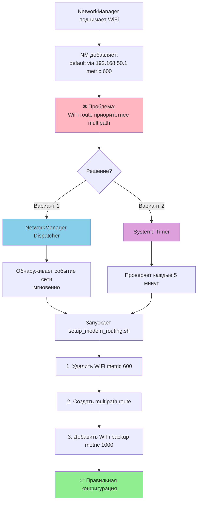
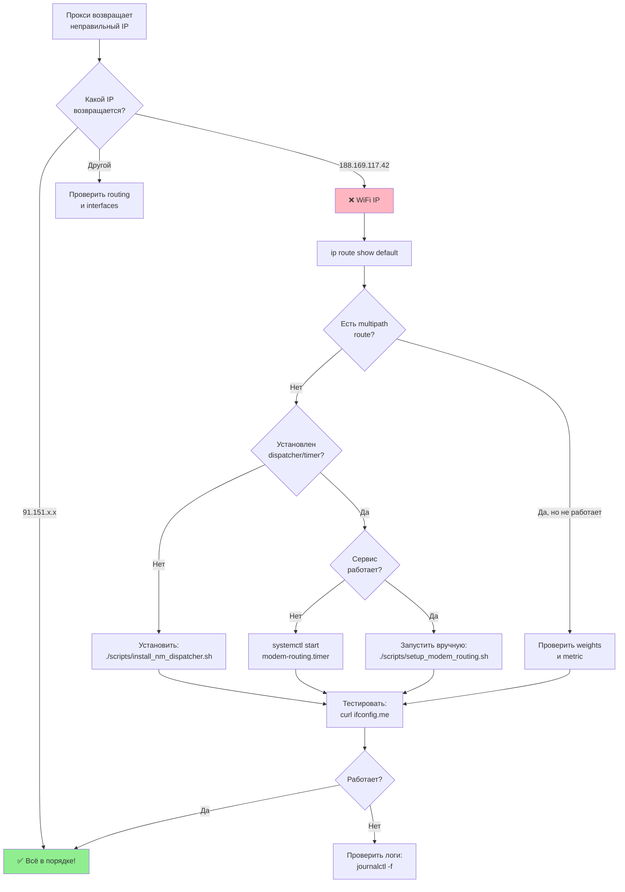

# Quick Reference Guide

Быстрая справка по ProxyFarm для повседневного использования.

## Основные команды

### Проверка состояния

```bash
# Полная диагностика системы
./scripts/check_system.sh

# Проверить маршруты
ip route show default

# Проверить модемы
mmcli -L
mmcli -m 0
mmcli -m 1

# Проверить IP адреса
ip addr show | grep inet

# Тестировать исходящие IP
curl ifconfig.me                    # default route
curl --interface wwan0 ifconfig.me  # modem 1
curl --interface wwan1 ifconfig.me  # modem 2
```

### Управление сервисами

```bash
# Squid
systemctl status squid
systemctl restart squid
tail -f /var/log/squid/access.log

# FastAPI (когда установлен)
systemctl status proxyfarm
journalctl -u proxyfarm -f

# Routing service (если используется)
systemctl status modem-routing.timer
systemctl status modem-routing.service
journalctl -u modem-routing -f

# OpenVPN
systemctl status openvpn@client
```

### Восстановление маршрутов

```bash
# Вручную запустить setup
cd /root/repo/proxyfarm
./scripts/setup_modem_routing.sh

# Проверить результат
ip route show default

# Должно быть:
# default nexthop via X.X.X.1 dev wwan0 weight 1 nexthop via Y.Y.Y.1 dev wwan1 weight 1
# default via 192.168.50.1 dev wlan0 metric 1000
```

### API команды

```bash
# Список модемов
curl localhost:8080/api/v1/modems

# Ротация IP
curl -X POST localhost:8080/api/v1/modems/0/rotate

# USSD (баланс)
curl -X POST localhost:8080/api/v1/modems/0/ussd \
  -H "Content-Type: application/json" \
  -d '{"command": "*100#"}'

# Статус прокси
curl localhost:8080/api/v1/proxy/status

# Статус системы
curl localhost:8080/api/v1/system/status
```

## Потоки данных

### Запрос через прокси

```
Client (любой IP)
    ↓
    | HTTP CONNECT 138.2.138.243:3128
    ↓
VPS (138.2.138.243)
    ↓ Socat forward
    | через OpenVPN tunnel (10.8.0.1 → 10.8.0.2)
    ↓
Orange Pi tun0 (10.8.0.2)
    ↓
    | localhost:3128
    ↓
Squid Proxy
    ↓
    | HTTP request
    ↓
Linux Kernel Routing
    ├─→ 50% wwan0 (91.151.136.x) ✓ ЖЕЛАЕМОЕ
    ├─→ 50% wwan1 (91.151.137.x) ✓ ЖЕЛАЕМОЕ
    └─→ WiFi (188.169.117.42)   ✗ ПРОБЛЕМА
    ↓
Target Server
```

### Таблица маршрутизации

#### ✅ Правильная конфигурация

```
default
    nexthop via 10.231.254.1 dev wwan0 weight 1
    nexthop via 10.223.35.1 dev wwan1 weight 1
default via 192.168.50.1 dev wlan0 metric 1000
```

**Результат:** Трафик идет через модемы (91.151.x.x)

#### ❌ Проблемная конфигурация

```
default via 192.168.50.1 dev wlan0 metric 600
```

**Результат:** Трафик идет через WiFi (188.169.117.42)

## Схема решения проблемы маршрутизации



## Troubleshooting Flowchart



## Сценарии использования

### Сценарий 1: Первая установка

```bash
# 1. Установить все зависимости
apt install -y squid modemmanager network-manager python3-pip

# 2. Настроить Squid
./scripts/setup_squid.sh

# 3. Установить persistence (выберите один)
./scripts/install_nm_dispatcher.sh      # рекомендуется
# или
./scripts/install_routing_service.sh

# 4. Проверить
./scripts/check_system.sh
curl ifconfig.me   # должен вернуть 91.151.x.x
```

### Сценарий 2: Маршруты сбросились

```bash
# 1. Быстрая диагностика
ip route show default

# 2. Если нет multipath route
./scripts/setup_modem_routing.sh

# 3. Проверить
curl ifconfig.me

# 4. Если проблема повторяется - установить persistence
./scripts/install_nm_dispatcher.sh
```

### Сценарий 3: Модем потерял связь

```bash
# 1. Проверить статус
mmcli -m 0

# 2. Если disconnected - переподключить
nmcli connection down gsm0
sleep 3
nmcli connection up gsm0

# 3. Подождать подключения (5-10 сек)
watch -n 1 'mmcli -m 0 | grep state'

# 4. Маршруты обновятся автоматически (если установлен dispatcher)
# Или вручную:
./scripts/setup_modem_routing.sh
```

### Сценарий 4: Ротация IP через API

```bash
# 1. Получить текущий IP
curl localhost:8080/api/v1/modems/0
# old_ip: 91.151.136.100

# 2. Ротировать
curl -X POST localhost:8080/api/v1/modems/0/rotate

# 3. Проверить новый IP (через 10-30 сек)
curl --interface wwan0 ifconfig.me
# new_ip: 91.151.136.234
```

### Сценарий 5: Тестирование балансировки

```bash
# Сделать 20 запросов
for i in {1..20}; do
  curl -s -x http://138.2.138.243:3128 http://ifconfig.me
  sleep 0.5
done | sort | uniq -c

# Ожидаемый результат:
# 10 91.151.136.231
# 10 91.151.137.37
```

## IP Адреса - Quick Reference

| Интерфейс | Внутренний IP | Внешний IP | Назначение |
|-----------|---------------|------------|------------|
| wwan0 | 10.231.254.x | 91.151.136.x | LTE Modem 1 ✓ |
| wwan1 | 10.223.35.x | 91.151.137.x | LTE Modem 2 ✓ |
| wlan0 | 192.168.50.111 | 188.169.117.42 | WiFi (backup) |
| tun0 | 10.8.0.2 | - | VPN tunnel |

### VPS IP адреса

| Интерфейс | IP | Назначение |
|-----------|-----|------------|
| Public | 138.2.138.243 | Публичный прокси |
| tun0 | 10.8.0.1 | VPN server |

## Порты

| Порт | Сервис | Доступ |
|------|--------|--------|
| 3128 | Squid Proxy | VPN (10.8.0.0/24) |
| 8080 | FastAPI | localhost |
| 22 | SSH | LAN (192.168.50.0/24) |
| 1194 | OpenVPN | VPS ↔ Orange Pi |

## Полезные метрики

### Нормальные значения

- **Сигнал модема:** 60-100% (хорошо), 20-60% (средне), <20% (плохо)
- **Латентность прокси:** 1-3 секунды
- **Время ротации IP:** 10-30 секунд
- **Балансировка:** ~40-60% на каждый модем
- **Uptime модемов:** >99%

### Признаки проблем

❌ **WiFi IP вместо модемного**
- Причина: Неправильные маршруты
- Решение: `./scripts/setup_modem_routing.sh`

❌ **Латентность >10 секунд**
- Причина: DNS проблемы или перегрузка
- Решение: Проверить Squid config, добавить DNS caching

❌ **Один модем не используется**
- Причина: Multipath route не настроен
- Решение: Проверить `ip route show default`

❌ **Частые disconnects**
- Причина: Слабый сигнал или проблемы оператора
- Решение: `mmcli -m 0 | grep signal`, переставить антенны

## Emergency Commands

### Если всё сломалось

```bash
# 1. Перезапустить все сервисы
systemctl restart NetworkManager
systemctl restart ModemManager
systemctl restart squid
systemctl restart openvpn@client

# 2. Переподключить модемы
nmcli connection down gsm0 && nmcli connection up gsm0
nmcli connection down gsm1 && nmcli connection up gsm1

# 3. Восстановить маршруты
./scripts/setup_modem_routing.sh

# 4. Проверить
./scripts/check_system.sh
```

### Если потерян SSH доступ

```bash
# Физический доступ к Orange Pi:

# 1. Подключить монитор + клавиатуру
# 2. Login: root / password: LpL##xX1!

# 3. Проверить сеть
ip addr show wlan0

# 4. Если нет IP - переподключить WiFi
nmcli connection up <wifi-name>

# 5. Восстановить SSH доступ
systemctl restart ssh
```

## Логи - где искать

```bash
# Squid access log
tail -f /var/log/squid/access.log

# Системные логи (все)
journalctl -f

# Конкретные сервисы
journalctl -u NetworkManager -f
journalctl -u ModemManager -f
journalctl -u squid -f
journalctl -u proxyfarm -f
journalctl -u modem-routing -f

# Последние ошибки
journalctl -p err -n 50

# NM Dispatcher события
journalctl | grep "NM-Dispatcher"
```

## Быстрые ссылки

- [Полная архитектура](../ARCHITECTURE.md)
- [Топология сети](NETWORK_TOPOLOGY.md)
- [Troubleshooting](TROUBLESHOOTING.md)
- [API документация](http://192.168.50.111:8080/docs)
- [Использование прокси](../PROXY_USAGE.md)

## Cheat Sheet - Одна команда

```bash
# Проверить всё сразу
echo "=== IP ===" && curl -s ifconfig.me && \
echo -e "\n=== Routes ===" && ip route show default && \
echo -e "\n=== Modems ===" && mmcli -L && \
echo -e "\n=== Squid ===" && systemctl is-active squid
```

Скопируйте и запустите для быстрой диагностики!
