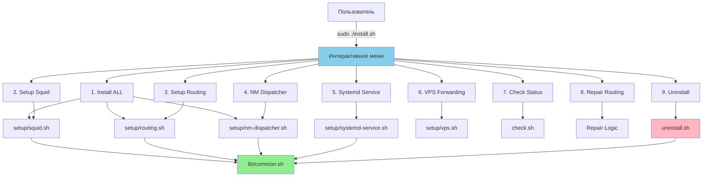
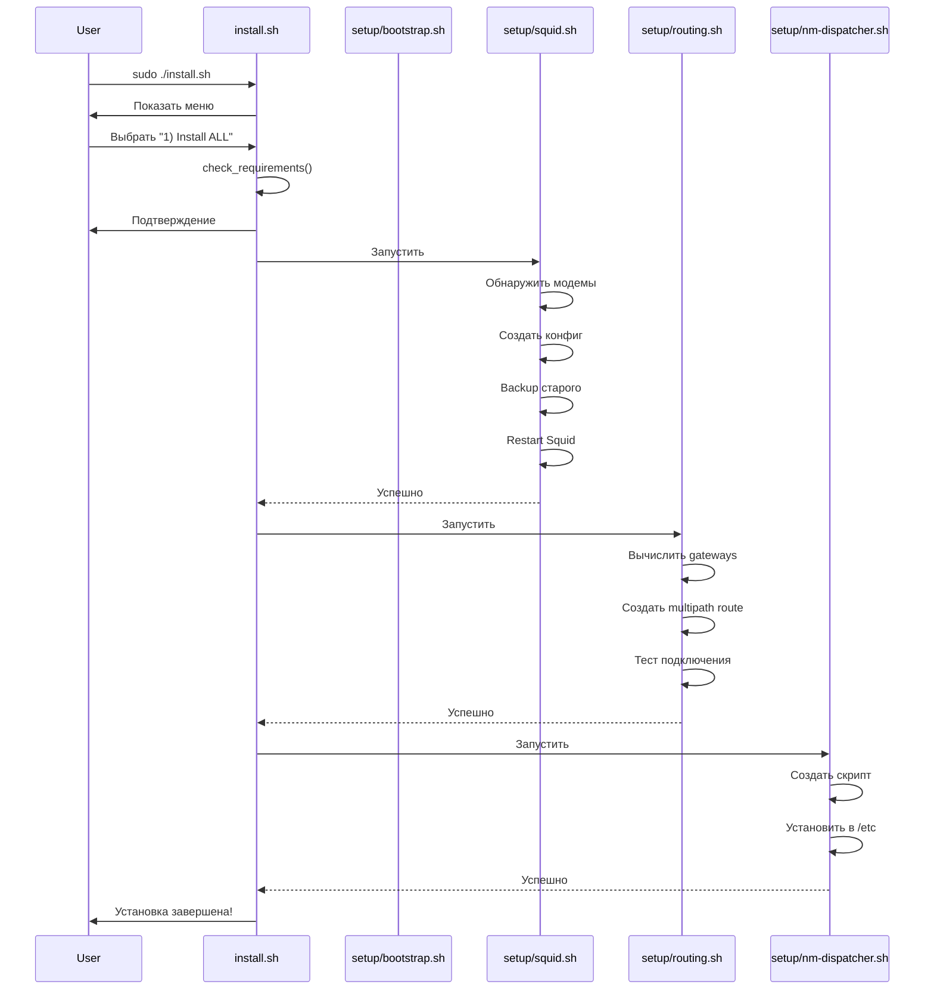
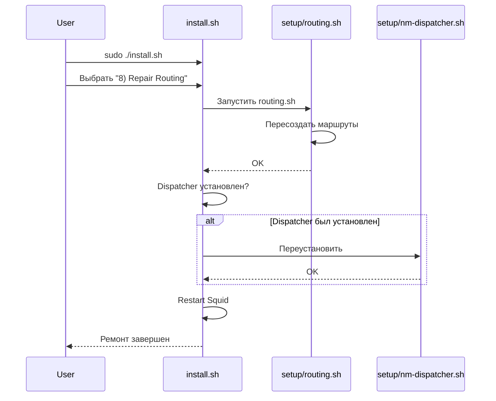
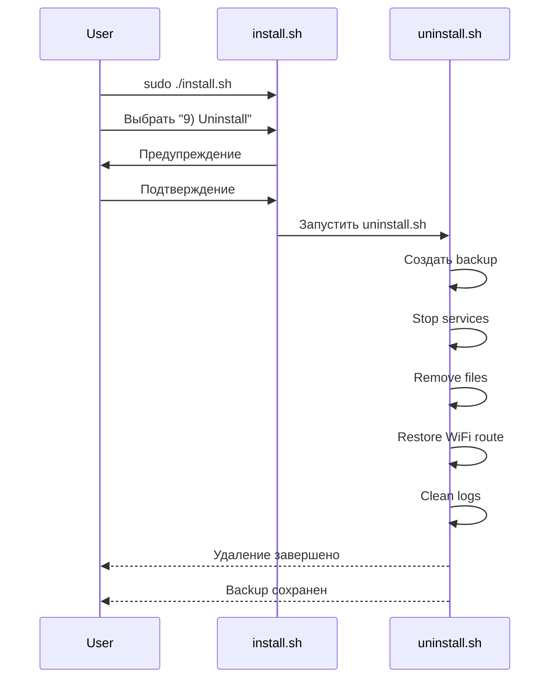

# Организация скриптов ProxyFarm

## Обзор

Все скрипты реорганизованы для удобства использования с единой точкой входа через интерактивное меню.

## Структура



## Файловая структура

```
scripts/
│
├── 🚀 install.sh              # ГЛАВНАЯ ТОЧКА ВХОДА
│   └─> Интерактивное меню для всех операций
│
├── 🗑️  uninstall.sh           # Удаление всех настроек
│   └─> Сохраняет OpenVPN, удаляет остальное
│
├── 🔍 check.sh               # Диагностика системы
│   └─> Можно запускать без root
│
├── 📦 install_app.sh         # Установка Python приложения
│   └─> Для FastAPI сервера (опционально)
│
├── setup/                     # Скрипты установки компонентов
│   ├── bootstrap.sh          # Начальная настройка системы
│   ├── squid.sh              # Настройка Squid proxy
│   ├── routing.sh            # Multipath routing
│   ├── nm-dispatcher.sh      # NetworkManager dispatcher
│   ├── systemd-service.sh    # Systemd service + timer
│   └── vps.sh                # VPS forwarding (socat)
│
├── lib/                       # Общие библиотеки
│   └── common.sh             # Функции: логирование, проверки, утилиты
│
└── backup/                    # Автоматические backup'ы
    ├── squid.conf.TIMESTAMP
    ├── nm-dispatcher-routing.TIMESTAMP
    └── uninstall_TIMESTAMP/
```

## Точки входа

### 1️⃣ install.sh - Главная точка входа

```bash
sudo ./install.sh
```

**Показывает меню:**
```
╔══════════════════════════════════════════════════╗
║          ProxyFarm Installation Menu             ║
╚══════════════════════════════════════════════════╝

Setup Components:
  1) Install ALL (Full Setup)
  2) Setup Squid Proxy
  3) Setup Multipath Routing
  4) Setup Routing Persistence (NetworkManager Dispatcher)
  5) Setup Routing Persistence (Systemd Service)
  6) Setup VPS Proxy Forwarding

Management:
  7) Check System Status
  8) Reinstall/Repair Routing
  9) Uninstall ProxyFarm

  0) Exit
```

**Функции:**
- Проверка системных требований
- Полная установка (Squid + Routing + Dispatcher)
- Установка отдельных компонентов
- Ремонт/переустановка
- Удаление

### 2️⃣ check.sh - Диагностика

```bash
./check.sh
```

**Показывает:**
- IP адреса всех интерфейсов
- Таблицу маршрутизации
- Статус модемов (mmcli)
- Bearer info (IP, gateway, DNS)
- Статус Squid, FastAPI, VPN
- Тесты исходящих IP (default, wwan0, wwan1)
- Последние ошибки в логах

### 3️⃣ uninstall.sh - Удаление

```bash
sudo ./uninstall.sh
```

**Удаляет:**
- ✅ Squid конфигурацию (с backup)
- ✅ Multipath routing
- ✅ NetworkManager dispatcher
- ✅ Systemd routing service/timer
- ✅ ProxyFarm приложение
- ✅ Логи ProxyFarm

**Сохраняет:**
- ❌ OpenVPN конфигурацию
- ❌ Модемные соединения (gsm0, gsm1)
- ❌ NetworkManager
- ❌ ModemManager

**Создает backup перед удалением в:**
```
backup/uninstall_YYYYMMDD_HHMMSS/
├── squid.conf
└── routes.txt
```

## Модули setup/

### bootstrap.sh - Начальная настройка

```bash
sudo ./setup/bootstrap.sh
```

**Устанавливает:**
- Системные пакеты (modemmanager, network-manager, squid, etc)
- Конфигурирует NetworkManager
- Включает IP forwarding
- Настраивает L4 multipath hashing

**Запускать один раз при первоначальной установке.**

### squid.sh - Настройка Squid

```bash
sudo ./setup/squid.sh
```

**Действия:**
1. Устанавливает Squid (если нет)
2. Определяет wwan интерфейсы и IP
3. Генерирует конфигурацию:
   - Порт 3128
   - Доступ с VPN (10.8.0.0/24)
   - DNS кеширование
   - Connection pooling
   - Оптимизация производительности
4. Бэкапит старый конфиг
5. Перезапускает Squid
6. Проверяет что сервис работает

### routing.sh - Multipath Routing

```bash
sudo ./setup/routing.sh
```

**Действия:**
1. Получает IP адреса wwan0 и wwan1
2. Вычисляет gateway (.1 в подсети)
3. Удаляет старый WiFi route (metric 600)
4. Добавляет WiFi backup (metric 1000)
5. Включает L4 multipath hashing
6. Создает multipath route:
   ```
   default nexthop via GW0 dev wwan0 weight 1 \
           nexthop via GW1 dev wwan1 weight 1
   ```
7. Тестирует подключение

**Можно запускать многократно** - безопасно пересоздает маршруты.

### nm-dispatcher.sh - NetworkManager Dispatcher

```bash
sudo ./setup/nm-dispatcher.sh
```

**Устанавливает:**
- Скрипт в `/etc/NetworkManager/dispatcher.d/99-modem-routing`
- Срабатывает при событиях: up, down, connectivity-change
- Автоматически запускает `routing.sh`
- Логирует в syslog и `/var/log/proxyfarm_routing.log`

**Рекомендуется для автоматического восстановления маршрутов.**

### systemd-service.sh - Systemd Service

```bash
sudo ./setup/systemd-service.sh
```

**Устанавливает:**
- `modem-routing.service` - запускает routing.sh
- `modem-routing.timer` - каждые 5 минут
- Запуск при загрузке системы
- Автоматический перезапуск при сбоях

**Альтернатива dispatcher'у**, если нужна периодическая проверка.

### vps.sh - VPS Forwarding

```bash
# ⚠️ Запускать на VPS, не на Orange Pi!
sudo ./setup/vps.sh
```

**Настраивает на VPS:**
- Socat для TCP forwarding
- VPS:3128 → 10.8.0.2:3128 (через VPN)
- Systemd service `socat-proxy`
- Автозапуск при перезагрузке

## Библиотека lib/common.sh

Общие функции используемые всеми скриптами.

### Логирование

```bash
log_info "Starting installation..."      # Синий [INFO]
log_success "Installation complete"      # Зеленый [SUCCESS]
log_warning "WiFi route found"           # Желтый [WARNING]
log_error "Modem not found"              # Красный [ERROR]
```

### UI

```bash
print_header "Installation"              # Заголовок с рамкой
print_step "Installing Squid..."         # Шаг с стрелкой
confirm "Continue?" "y"                  # Запрос подтверждения
press_enter                              # Пауза
```

### Проверки

```bash
check_root                               # Проверка прав root
command_exists "mmcli"                   # Команда установлена?
check_dependencies mmcli nmcli          # Все зависимости есть?
service_exists "squid"                   # Сервис существует?
service_is_active "squid"                # Сервис запущен?
```

### Управление файлами

```bash
backup_file "/etc/squid/squid.conf" "squid.conf"
safe_remove "/path/to/file" "backup_name"
stop_service "squid"
```

### Сетевые утилиты

```bash
get_modem_interfaces                     # wwan0 wwan1 ...
count_modems                             # 2
has_multipath_route                      # true/false
get_wifi_connection                      # "MyWiFi"
has_nm_dispatcher                        # true/false
has_routing_service                      # true/false
has_squid_config                         # true/false
```

## Workflow

### Первая установка



### Ремонт маршрутизации



### Удаление



## Миграция от старых скриптов

### Было (до реорганизации)

```bash
# Разрозненные скрипты
./scripts/setup_squid.sh
./scripts/setup_modem_routing.sh
./scripts/install_nm_dispatcher.sh
./scripts/install_routing_service.sh
./scripts/setup_vps_proxy_forward.sh
./scripts/check_system.sh
```

### Стало (после реорганизации)

```bash
# Единая точка входа
./scripts/install.sh               # Меню для всего

# Или напрямую
./scripts/setup/squid.sh
./scripts/setup/routing.sh
./scripts/setup/nm-dispatcher.sh
./scripts/setup/systemd-service.sh
./scripts/setup/vps.sh
./scripts/check.sh
```

### Что изменилось

1. **Добавлено:**
   - ✅ `install.sh` - интерактивное меню
   - ✅ `uninstall.sh` - удаление всех настроек
   - ✅ `lib/common.sh` - общие функции
   - ✅ `setup/bootstrap.sh` - начальная настройка

2. **Переименовано:**
   - `setup_squid.sh` → `setup/squid.sh`
   - `setup_modem_routing.sh` → `setup/routing.sh`
   - `setup_vps_proxy_forward.sh` → `setup/vps.sh`
   - `check_system.sh` → `check.sh`

3. **Объединено:**
   - `install_nm_dispatcher.sh` → `setup/nm-dispatcher.sh`
   - `install_routing_service.sh` → `setup/systemd-service.sh`
   - `nm-dispatcher-routing.sh` → создается автоматически

4. **Удалено:**
   - Дублирующиеся скрипты
   - Устаревшие временные файлы

## Преимущества новой структуры

### 1. Единая точка входа
- Один скрипт `install.sh` для всех операций
- Интуитивное меню
- Не нужно помнить имена скриптов

### 2. Организация
- Логическое разделение на папки
- setup/ - установка компонентов
- lib/ - общий код
- backup/ - резервные копии

### 3. Повторное использование кода
- Все функции в `lib/common.sh`
- Единый стиль логирования
- Общие проверки и утилиты

### 4. Безопасность
- Автоматические backup'ы перед изменениями
- Подтверждение опасных операций
- Сохранение OpenVPN при удалении

### 5. Удобство отладки
- Цветной вывод
- Детальные логи
- check.sh для быстрой диагностики

### 6. Документация
- README.md в scripts/
- Комментарии в каждом скрипте
- Примеры использования

## Рекомендации по использованию

### Для новых пользователей

1. Запустите `./install.sh`
2. Выберите "1) Install ALL"
3. Следуйте инструкциям
4. Запустите `./check.sh` для проверки

### Для опытных пользователей

```bash
# Прямой вызов нужных компонентов
sudo ./setup/bootstrap.sh        # Первый раз
sudo ./setup/squid.sh            # Squid
sudo ./setup/routing.sh          # Маршрутизация
sudo ./setup/nm-dispatcher.sh    # Persistence

# Проверка
./check.sh
```

### Для разработчиков

- Все общие функции в `lib/common.sh`
- Добавляйте новые скрипты в `setup/`
- Используйте функции логирования
- Создавайте backup'ы перед изменениями
- Пишите в `backup/` для временных файлов

## Troubleshooting

### Скрипт не запускается

```bash
# Проверить права
ls -l install.sh
# Если нет x, добавить:
chmod +x install.sh

# Проверить источник common.sh
head -5 install.sh
# Должно быть: source "$SCRIPT_DIR/lib/common.sh"
```

### Ошибка "common.sh not found"

```bash
# Проверить структуру
ls -la lib/
# Должен быть lib/common.sh

# Если нет, возможно неправильная директория
pwd
# Должно быть: /root/repo/proxyfarm/scripts
```

### Menu не отображается

```bash
# Проверить что запущено от root
sudo ./install.sh

# Если проблема с кодировкой
export LANG=en_US.UTF-8
sudo ./install.sh
```

## Будущие улучшения

- [ ] Добавить `./scripts/update.sh` для обновления из git
- [ ] Автоматическое определение VPS vs Orange Pi
- [ ] Интеграция с config.yaml
- [ ] Web UI для управления
- [ ] Ansible playbook как альтернатива
- [ ] Docker контейнеризация скриптов
- [ ] CI/CD для тестирования скриптов
- [ ] Поддержка других дистрибутивов (не только Debian/Ubuntu)
